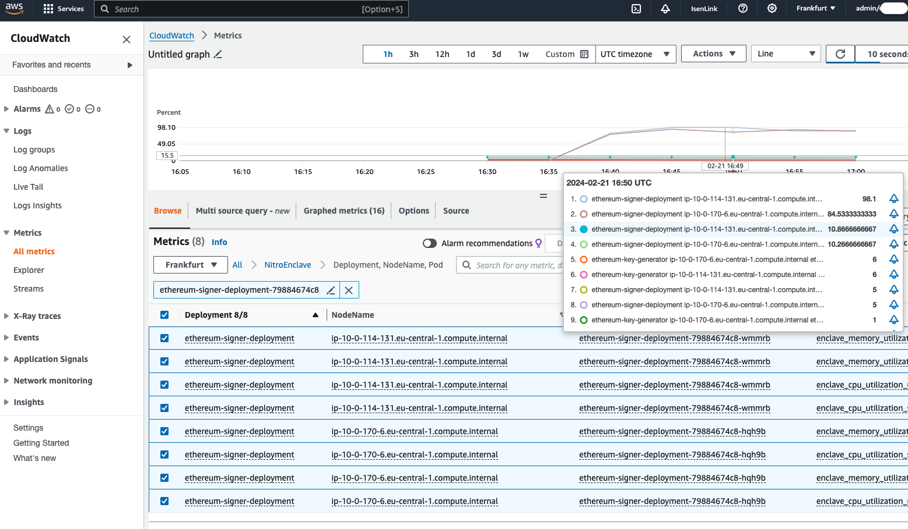

# Secure Blockchain Workloads using AWS Nitro Enclaves on EKS

## Architecture

### EKS Deployment Overview

The following diagram depicts the high level architecture of the solution that is enclosed in this AWS CDK
repository which will be deployed to the specified AWS account.


---

## Development, Integration Tests and Requests

### Application
All docker containers run linters and static security checks also on cross Lambda, pod and enclave dependencies for every deployment.
Example below from `applications/ethereum-signer/images/key-generator_enclave/Dockerfile`.

```dockerfile
ARG generator_enclave_folders='./cmd/key-generator_enclave/... ./internal/...'
RUN staticcheck $generator_enclave_folders
RUN gosec $generator_enclave_folders
RUN go test $generator_enclave_folders -test.v
RUN CGO_ENABLED=0 GOOS=linux go build -a -ldflags '-extldflags "-static"' ./cmd/key-generator_enclave
```

### e2e Integration Test
A full cluster and application deployment including load testsing and cleanup can be triggerred by the following script:
```shell
./tests/e2e/run_test_pipeline.sh
```

Please be aware that a full e2e integration test run including cluster creation and resource cleanup can take up to and hour.


### Requests
Postman collections specifying `key` and `signature` creation requests can be found in `tests/e2e/postman`. 

---

## Deployment

**Disclaimer**
Please be aware of changes happening to upstream dependencies.
* [Docker >v25+ compatibility](https://github.com/aws/aws-nitro-enclaves-cli/pull/595)
* [Device driver enclave support](https://github.com/aws/aws-nitro-enclaves-k8s-device-plugin/pull/13)
* [Go <v1.22 issue](https://github.com/aws/aws-nitro-enclaves-k8s-device-plugin/issues/14)

### Prerequisites

* An [AWS account](https://signin.aws.amazon.com/signin?redirect_uri=https%3A%2F%2Fportal.aws.amazon.com%2Fbilling%2Fsignup%2Fresume&client_id=signup)
* An [AWS Identity and Access Management](http://aws.amazon.com/iam) (IAM) user with administrator access
* [Configured AWS credentials](https://docs.aws.amazon.com/cdk/latest/guide/getting_started.html#getting_started_prerequisites)
* [Docker](https://docs.docker.com/get-docker/), [Node.js](https://nodejs.org/en/download/)
  , [Python 3.9](https://www.python.org/downloads/release/python-3916), [pip](https://pip.pypa.io/en/stable/installing/),
  and [jq](https://stedolan.github.io/jq/) installed on the workstation that you plan to deploy the solution from. Note
  that the solution is only compatible with Python 3.9.

### AWS CDK and Stack Dependencies

* virtual environments ([venv](https://docs.python.org/3/library/venv.html#module-venv)) are recommended working with
  Python
* AWS CDK per default leverages virtual
  environments. [See how to activate virtualenv](https://cdkworkshop.com/30-python/20-create-project/200-virtualenv.html)

   ```shell
   npm install -g aws-cdk && cdk –version
   ```

1. Install the AWS CDK and test the AWS CDK CLI:

   ```shell
   npm install -g aws-cdk && cdk –version
   ```

2. Download the code from the GitHub repo and change to the new directory:

   ```shell
   git clone git@github.com:aws-samples/nitro-enclave-blockchain-wallet-on-eks.git
   ```

3. Change to the `nitro-enclave-blockchain-wallet-on-eks` repository:

   ```shell
   cd nitro-enclave-blockchain-wallet-on-eks
   ```

4. Install the dependencies using the Python package manager:

   ```shell
   pip install -r requirements.txt
   pip install -r requirements-dev.txt
   ```

### EKS Cluster Deployment

The CDK deployment region needs to be specified before any app can be deployed.
This can either be done by `CDK_DEPLOY_REGION` environment variable. `CDK_DEFAULT_ACCOUNT` needs to point to your
configured `aws` account. Please be aware, if you choose a different `CDK_RREFIX` as the shown below (`dev`) all subsequent
cdk commands need to be executed with the correct prefix, e.g. `cdk deploy testEksNitroCluster ...` if you choose the value `test`
for `CDK_REFIX`.

```shell
export CDK_DEPLOY_REGION=eu-central-1
export CDK_DEPLOY_ACCOUNT=$(aws sts get-caller-identity | jq -r '.Account')
export CDK_PREFIX=dev
export CDK_TARGET_ARCHITECTURE=linux/amd64
```

If the EKS cluster should be deployed on AWS Graviton instances, set the following environment variable:

```shell
export CDK_TARGET_ARCHITECTURE=linux/arm64
```
Per default, `'linux/amd64` is being chosen for now due to the easier downstream dependency and build management.

1. Deploy the EKS cluster and other required services:

    ```shell
    # create the dedicated eif folder and add two prefix specific dummy files to allow cdk to successfully synthesize
    # before triggering deployment
    mkdir -p ./applications/ethereum-signer/third_party/eif
    touch ./applications/ethereum-signer/third_party/eif/${CDK_PREFIX}ethereum{-signer,-key-generator}_enclave.eif
    cdk deploy devEksNitroCluster --verbose -O devEksOutput.json --require-approval=never
    ```

2. Configure `kubectl` to point to your EKS cluster:
    ```shell
    ./scripts/configure_environment.sh devEksOutput.json
    ```
    Your `kubectl` cli has now been pointed to the AWS Nitro Enclave enabled EKS cluster.

3. Ensure the deployment of `external-dns`, `fluent-bit` and the `aws-nitro-enclaves-k8s-daemonset` by executing the following command:
    ```shell
    kubectl get pods --namespace aws-for-fluent-bit
    kubectl get pods --namespace external-dns
    kubectl get pods --namespace kube-system
    ```
   
### Ethereum App Stack Deployment

#### Notes on cross-platform deployments
* [Buildx](https://www.docker.com/blog/how-to-rapidly-build-multi-architecture-images-with-buildx/) needs to be available on MacOS
* To significantly speed up RUST toolchain cross compile, leverage Graviton EC2 instance for `kmstool_enclave_cli` build. `arm` binary 
  needs to be placed in `applications/ethereum-signer/third_party/kms_arm64` folder before triggering `./scripts/build_enclave_image.sh ethereum-signer` build step.
* The entire deployment of a cross-platform application takes **significant** more time since that static code scans,
  tests and build steps are enclosed in the Dockerfiles and are also being executed in a virtualization framework.
  

#### Deployment

1. Build dependencies, the enclave Dockerfile and turn it into an `.eif` file. The target region is already provided
   during the build step.
   Please ensure that the **`CDK_DEPLOY_REGION`** environment variable has been set successfully with the correct value
   before triggering the build.

   Static tests can be turned off via the `CDK_SKIP_TESTS` environment variable:
   ```shell
   export CDK_SKIP_TESTS=true
   export CDK_APP_LOG_LEVEL=info
   ```
   
   ```shell
   ./scripts/build_enclave_image.sh ethereum-key-generator && \
   ./scripts/build_enclave_image.sh ethereum-signer
   ```

2. Build Dockerfile for key generator and signer pod and upload to ECR. Upload `key generator` and `signer`
   enclave `eif` files to S3
   as assets:

   ```shell
   cdk deploy devEthKeyManagementApp --verbose --require-approval=never
   ```

3. Deploy the enclaves, pods and k8s service definitions to the EKS cluster. The NLB cluster operator will create two
   NLB
   that will get `generator.<stackname>.private` and `signer.<stackname>.private` domain name attached.
   ```shell
   ./scripts/apply_deployment_spec.sh
   ```

4. Ensure that the app workloads have been deployed to the `default` namespace by running the  following command:
   ```shell
   kubectl get pods
   ```
   You should see 4 pods deployed in total - 2 `ethereum-key-generator` pods and 2 `ethereum-signer` pods.

5. Configure the KMS key resource policy by running the following command:
   ```shell
   kms_key_id=$(aws ssm get-parameter --name "/${CDK_PREFIX}app/ethereum/key_id" --region "${CDK_DEPLOY_REGION}" | jq -r ".Parameter.Value")

   ./scripts/generate_key_policy.sh ethereum-signer > key_policy.json
   aws kms put-key-policy --region "${CDK_DEPLOY_REGION}" --policy-name default --key-id "${kms_key_id}" --policy file://key_policy.json
   ```
    Debug settings in the key policy will be set up according to the chosen log_level in `CDK_APP_LOG_LEVEL`. Please be aware,
    if `debug` mode is supposed to be activated, the `CDK_APP_LOG_LEVEL` environment varaible needs to be set to `DEBUG` and the 
    application including the enclaves need to be deployed again.

6. To test the deployment run the e2e test with the following parameters:
   ```shell
   ./tests/e2e/signing_load_test.sh load 1 1
   ```
   
   The first number indicates the amount of parallel runners, the second the number of signing rounds. A single round consists of an `UserOp` and `EthereumTX` signature.
   This test requires `newman` cli and will fail if it's not available in your `$PATH`.

7. If workloads have been updated, run `update_deployment.sh` to build and update the new workloads. If no argument or `none` is given,
   just the `pods` will be re-build and deployed. If `ethereum_key_generator` or `ethereum_signer` or `all` is being given the associated
   enclaves will be build and re-deployed as well.
   ```shell
   ./scripts/update_deployment.sh <ethereum_key_generator,ethereum_signer,all,none>
   ```

---

### How to use Application
To interact with the application use the provided API Gateway endpoint. The only supported authentication right now is AWS Signature Version 4 (SigV4).

The following code example from the `/tests/e2e/e2e_signing_load_test.sh` script shows how to get the endpoint parameter and pass valid SigV4 credentials to the postman collection (`"./tests/e2e/postman/eks_nitro_wallet.postman_collection.json"`).
```shell
POSTMAN_COLLECTION="./tests/e2e/postman/eks_nitro_wallet.postman_collection.json"

# get role arn
api_role_arn=$(aws ssm get-parameter --name "/${CDK_PREFIX}app/ethereum/rest_url_role_arn" --region "${CDK_DEPLOY_REGION}" | jq -r ".Parameter.Value")

# get url
api_endpoint=$(aws ssm get-parameter --name "/${CDK_PREFIX}app/ethereum/rest_url" --region "${CDK_DEPLOY_REGION}" | jq -r ".Parameter.Value")

# assume rest api role
AWS_SESSION_TOKEN_RESPONSE=$(aws sts assume-role --role-arn "${api_role_arn}" --region "${CDK_DEPLOY_REGION}" --role-session-name TestUserSession)

aws_session_token=$(jq -r '.Credentials.SessionToken' <(echo "${AWS_SESSION_TOKEN_RESPONSE}"))
aws_secret=$(jq -r '.Credentials.SecretAccessKey' <(echo "${AWS_SESSION_TOKEN_RESPONSE}"))
aws_key=$(jq -r '.Credentials.AccessKeyId' <(echo "${AWS_SESSION_TOKEN_RESPONSE}"))
aws_region="${CDK_DEPLOY_REGION}"
```

---

### Cleanup

To avoid additional costs after using the EKS Nitro Wallet solution, follow the steps to delete all deployed artifacts.

1. Delete all deployments and associated services:
   ```shell
   ./scripts/delete_deployment.sh ethereum-key-generator; \
   ./scripts/delete_deployment.sh ethereum-signer
   ```
   Please be aware that not deleting **all kubernetes resources** prior to triggering `cdk` delete in step 2 can cause
   errors, resulting in some AWS resources not being able to be deleted automatically.

2. Delete the `EthereumAppStack` cloud formation stack followed by the `EksNitroWalletStack` stack. The order of delete
   operations cannot be changed. Please be aware that the deletion of both stacks can take up to 30min.
   ```shell
   cdk destroy devEthereumAppStack --force && \
   cdk destroy devEksNitroWalletStack --force
   ```

3. If you want to delete all resources and local files in the right order you can also use the provided cleanup script:
   ```shell
   ./tests/e2e/cleanup.sh
   ```

---

### Ethereum Key Generator <a name="create_or_import_key"></a>

**Key Generation Application**


[//]: # (1. Use the request below to generate a new Ethereum key inside the Nitro Enclave leveraging hardware seeded entropy &#40;NSM&#41;,)

[//]: # (   have it encrypted and stored in the DynamoDB)

[//]: # (   table. The secret needs to consist of 64 characters, preferably a `sha256` hex-string representation of your secret)

[//]: # (   password.)

[//]: # ()
[//]: # (   ```shell)

[//]: # (   sha256sum <<< "MyPassword" | awk '{ print $1 }')

[//]: # (   ```)

[//]: # ()
[//]: # (   ```json)

[//]: # (   {)

[//]: # (     "operation": "ethereum-key-generator_generate_key",)

[//]: # (     "payload": {)

[//]: # (       "secret": "5e618e009fe35ea092150ad1f2c24e3181b4cf6693dc7bbd9a09ea9c8144720d")

[//]: # (     })

[//]: # (   })

[//]: # (   ```)

[//]: # ()
[//]: # (   If external keys should be imported into the system, they can be provided via the following request. Lambda would)

[//]: # (   encrypt the private key/secret combination via KMS and stores it in DynamoDB.)

[//]: # (   ```json)

[//]: # (   {)

[//]: # (     "operation": "ethereum-signer_set_key",)

[//]: # (     "payload": {)

[//]: # (       "eth_key": "6835311872e1c63b50a8edd16605e2253c2a9c58ef9bf41f1d1c0c724981931a",)

[//]: # (       "secret": "5e618e009fe35ea092150ad1f2c24e3181b4cf6693dc7bbd9a09ea9c8144720d")

[//]: # (     })

[//]: # (   })

[//]: # (   ```)

[//]: # ()
[//]: # (   If successful, both operations mentioned before would return a `key_id` that uniquely identifies the encrypted key)

[//]: # (   inside the DynamoDB secrets table:)

[//]: # (   ```json)

[//]: # (   {)

[//]: # (     "key_id": "1aadbab3-f76c-4b34-a1f0-9efa5f18d3e0")

[//]: # (   })

[//]: # (   ```)

[//]: # ()
[//]: # (2. The `secret` specified in the key-generate request acts as an API key later on. It must be equal or longer than 20)

[//]: # (   alphanumeric characters.)

[//]: # (   If successful, you can use the returned `keyID` for the `ethereum-signer` application along with the right secret to)

[//]: # (   sign Ethereum transactions using the newly generated key.)

#### Explanation
The following diagram depicts the interaction of the different services involved in `key_generation` and `key_storage`. 


1. Generate key request is being sent with the hash of a secret
2. The request is augmented with temporary AWS credentials and being passed into the enclave
3. Hardware based entropy is being used to generate the blockchain private key
4. Blockchain private key is being passed along with KMS KeyID specified to AWS KMS for encryption, using the standard Go(lang) SDK through https tunnel
5. Ciphertext is being returned to enclave via https tunnel
6. Ciphertext is being stored in DynamoDB secretes table using the standards Go(lang) SDK through https tunnel
7. DynamoDB creates KeyID for ciphertext entry
8. KeyID is being returned to user

---

### Ethereum Signer Application

**Signing Application**


[//]: # (1. Sing an Ethereum transaction specifying the `key_id` and user `secret` along with the EIP1559 tx)

[//]: # (   parameters like in the request below:)

[//]: # (   ```json)

[//]: # (   {)

[//]: # (     "operation": "ethereum-signer_sign_transaction",)

[//]: # (     "payload": {)

[//]: # (       "transaction_payload": {)

[//]: # (         "value": 0.01,)

[//]: # (         "to": "0xa5D3241A1591061F2a4bB69CA0215F66520E67cf",)

[//]: # (         "nonce": 0,)

[//]: # (         "type": 2,)

[//]: # (         "chainId": 4,)

[//]: # (         "gas": 100000,)

[//]: # (         "maxFeePerGas": 100000000000,)

[//]: # (         "maxPriorityFeePerGas": 3000000000)

[//]: # (       },)

[//]: # (       "key_id": "648a8e6f-a150-49f7-878e-2dafe77d9c10",)

[//]: # (       "secret": "5e618e009fe35ea092150ad1f2c24e3181b4cf6693dc7bbd9a09ea9c8144720d")

[//]: # (     })

[//]: # (   })

[//]: # (   ```)

[//]: # ()
[//]: # (   ```json)

[//]: # (   {)

[//]: # (     "operation": "ethereum-signer_sign_transaction",)

[//]: # (     "payload": {)

[//]: # (       "transaction_payload": {)

[//]: # (         "userOpHash": "5033589a303c005b7e7818f4bf00e7361335f51f648be16c028951f90a1585d4")

[//]: # (       },)

[//]: # (       "key_id": "1aadbab3-f76c-4b34-a1f0-9efa5f18d3e0",)

[//]: # (       "secret": "9779d2b8f0bc495b1691ce1a2baf800453e18a58d4eea8bf1fe996a0ab291dba")

[//]: # (     })

[//]: # (   })

[//]: # (   ```)

[//]: # ()
[//]: # (   The key can either be generated or imported as described in the)

[//]: # (   section [above]&#40;#configure-and-use-application-a-namecreateorimportkey-a&#41;.)

[//]: # ()
[//]: # (   If successful, the serialized signed transaction and its hash value will be returned like in the response shown)

[//]: # (   below:)

[//]: # (   ```json)

[//]: # (   {)

[//]: # (     "transaction_signed": "0x02f873048084b2d05e0085174876e800830186a094a5d3241a1591061f2a4bb69ca0215f66520e67cf872386f26fc1000080c001a0532545d1f03732f14e079ffa654af836a9cf1c119091f7c9bc3fd15874c5e05da01b40f921e10add034cec47e60c687c212de18fecd581288048ce173124960ab1",)

[//]: # (     "transaction_hash": "0x74b4789b79b019b62a535b9fbacf6b3161ca6d2deffe36565c2814520e97fdd3")

[//]: # (   })

[//]: # (   ```)

#### Explanation


1. Sign transaction request hmac(tx_parameter, key_id), secret  → not being passed, just used in hmac
2. KeyID ciphertext is being loaded from DynamoDB secrets table 
3. tx_signing_request being passed into enclave along with ciphertext
4. Enclave decrypts ciphertext with kmstool-enclave-cli 
5. Enclave validates hmac of tx_signing_request based on plaintext secret in key
    1. Ensure message integrity
    2. Archive authentication via secret
6. Enclave signs transaction
7. Enclave deletes key
8. Enclave returns singed transaction

---

### Notes

#### Metrics
Pod related metrics can be read via `metrics` server e.g. via [`k9s`](https://k9scli.io/) tool. Enclave related `cpu` and `memory` metrics are being pushed to `NitroEnclave` namespace in CloudWatch.
These metrics can be leveraged for CloudWatch alarms and thus become actionable for scaling related events e.g. via Lambda functions. Please refer to this [blog](https://aws.amazon.com/blogs/containers/autoscaling-amazon-eks-services-based-on-custom-prometheus-metrics-using-cloudwatch-container-insights/) for more information on EKS scaling. 




#### Notes on High Availability

Per default, each workload consist of `2` replicas distributed over the Nitro Enclave enabled k8s nodes. A service
load balancer distributes the requests to the pods in a round-robin fashion. The nodes are per default configured to be located in different AZs.

#### Notes on Isolation Properties
* Each pod can see its associated enclaves [exclusively](https://github.com/aws/aws-nitro-enclaves-k8s-device-plugin/pull/13#discussion_r1481653355).
* All enclaves share one EKS node thus CIDs need to be unique. If no CID is being specified, the hypervisor will 
  associate a unique CID for each new enclave and avoid collisions.
* Incoming requests on pods from enclaves, e.g. `vsock-proxy` are not filtered by associated enclaves.
  As a consequence:
  - different enclaves can use the same `vsock-proxy` process running on a single pod
  - a central network outbound `vsock-proxy` can be started and shared for all enclaves that have the same outbound destination e.g. KMS.
  - pods basically just run network forward-logic. Consider running a single pod with several enclaves to share resources.
  - avoid pre-authorized services running on the pods waiting for incoming vsock connections.
  - filter by source CID if cross pod communication for enclaves should be avoided
  - leverage authenticated connections such as [TUN interfaces](https://github.com/balena/wireguard-go-vsock) for secure point-to-point connections

#### Notes on Port Collisions
* Pods that open listeners on CID `3` (vm host) have to use different ports, otherwise collisions will occur
* This deployment assign a random `vsock_base_port` number to each application. Metrics port and vsock listener ports are being derived from this number 
* Enclave CIDs will be orchestrated(incremented) per default by Hypervisor to avoid collisions

---

### Troubleshooting

#### Docker Image Pull Error (failed to unpack image on snapshotter overlayfs)
```shell
"CannotPullContainerError: ref pull has been retried 1 time(s): failed to unpack image on snapshotter overlayfs: failed to extract layer sha256:c02342326b04a05fa0fc4c703c4aaa8ffb46cc0f2eda269c4a0dee53c8296182: failed to get stream processor for application/vnd.in-toto+json: no processor for media-type: unknown"
```
**Soulution**
* Issue might be related to `https://github.com/aws/aws-cdk/issues/30258`
* Set `BUILDX_NO_DEFAULT_ATTESTATIONS=1` in your environment e.g. `export BUILDX_NO_DEFAULT_ATTESTATIONS=1`

#### Docker Image Pull Error
```shell
Start building the Enclave Image...
Docker error: PullError
[ E50 ] Docker image pull error. Such error appears when trying to build an EIF file, but pulling the corresponding docker image fails. In this case, the error backtrace provides detailed informatino on the failure reason.

For more details, please visit https://docs.aws.amazon.com/enclaves/latest/user/cli-errors.html#E50

If you open a support ticket, please provide the error log found at "/var/log/nitro_enclaves/err2024-05-28T09:39:23.373384530+00:00.log"
```

**Solution**
* Ensure that you are using `nitro-cli` > `v1.3.0`.
* Consider downgrading the docker version to `<v25.x`
* If versions cannot be adjusted, e.g. due to compliance reasons build `nitro-cli` locally via provided scripts:
  1. Build cli via `scripts/build_nitro_cli.sh`
  2. Change build image reference (`NITRO_EKS_BASE_BUILD_IMAGE`) accordingly in `scripts/build_enclave_image.sh`  

#### Nitro Enclave Device Driver cannot be compiled
```shell
26.47 k8s.io/kubelet/pkg/apis/deviceplugin/v1beta1: cannot compile Go 1.22 code
------
Dockerfile:18
--------------------
  16 |         go mod vendor
  17 |
  18 | >>> RUN CGO_ENABLED=0 go build -a -ldflags='-s -w -extldflags="-static"' .
  19 |
  20 |     # Create a bare minumum image that only contains the device plugin binary.
--------------------
ERROR: failed to solve: process "/bin/sh -c CGO_ENABLED=0 go build -a -ldflags='-s -w -extldflags=\"-static\"' ." did not complete successfully: exit code: 1
```

**Solution**
Ensure that the Dockerfile located in `applications/ethereum-signer/third_party/aws-nitro-enclaves-k8s-device-plugin/container/Dockerfile` 
has been replaced with the file located in `lib/docker/Dockerfile_device_plugin_amazon_linux_2023`. The CDK per default copies the
Amazon Linux 2023 based Dockerfile to the repo as an alternative build file.

#### Pods are in `CrashLoopBackOff` state
```shell
kubectl get pods
NAME                                                 READY   STATUS             RESTARTS      AGE
ethereum-key-generator-deployment-5c4c545799-bvbnd   0/1     CrashLoopBackOff   5 (27s ago)   12m
ethereum-key-generator-deployment-5c4c545799-glzgh   0/1     CrashLoopBackOff   6 (30s ago)   12m
ethereum-signer-deployment-8555b66cc4-nwbbw          0/1     CrashLoopBackOff   6 (95s ago)   12m
ethereum-signer-deployment-8555b66cc4-pfjkc          0/1     CrashLoopBackOff   6 (3m ago)    12m
```

Use `kubectl logs -f <pod name>` to get more details.

```shell
Started enclave with enclave-cid: 17, memory: 2048 MiB, cpu-ids: [1, 5]
[ E36 ] Enclave boot failure. Such error appears when attempting to receive the `ready` signal from a freshly booted enclave. It arises in several contexts, for instance, when the enclave is booted from an invalid EIF file and the enclave process immediately exits, failing to submit the `ready` signal. In this case, the error backtrace provides detailed information on what specifically failed during the enclave boot process.
```

**Solution**:

The error above might indicate an issue with the wrong target platform architecture - ensure that no outdated `.eif` files have been used.
Trigger enclave rebuild and redeployment with the following command:
```shell
./scripts/update_deployment.sh all
```

#### kmstool_enclave_cli

The following error indicates an issue with the KMS key policy and or the Enclave `debug` mode.

```json
{
  "enclave_status": 500,
  "enclave_result": {
    "error": "exception happened decrypting passed ciphertext: kmstool_enclave_cli exited with status different from 0: exit status 255\nerror output: Got non-200 answer from KMS: 400\nCould not decrypt ciphertext\nCould not decrypt\n\n"
  }
}
```

**Solution**:

The error could be caused by the wrong `PCR_*` value used in the key policy which might not be suitable with your
current `debug` settings.
Enclave `DEBUG_MODE` just supports the following PCR_0
policy: `000000000000000000000000000000000000000000000000000000000000000000000000000000000000000000000000`.

#### KMS

```shell
https://kms.us-east-1.amazonaws.com/\\\": x509: certificate is valid for kms.eu-central-1.amazonaws.com, kms-a.eu-central-1.amazonaws.com, kms-b.eu-central-1.amazonaws.com, kms-c.eu-central-1.amazonaws.com, kms-d.eu-centra"
```

**Solution**:

The error indicates that the enclave tries to connect to a KMS endpoint in a different region, here `us-east-1` instead
of `eu-central-1`.
Please make sure that you have the right region configured via `export CDK_DEPLOY_REGION=<my-region>` and trigger the
enclave build again.

#### Route53

```json
{
  "errorMessage": "Post \"https://ethereum-key-generator.devEksNitroWalletStack.private:8080\": dial tcp: lookup ethereum-key-generator.devEksNitroWalletStack.private on 169.254.78.1:53: no such host",
  "errorType": "Error"
}
```

**Solutions**:

* propagation time for first time deployment (~5min) so that requests can be served via Route53
* make sure that there is only one hosted zone registered in Route53

#### VPC Could not be found issue

```shell
| NitroSignerSG (NitroSigner12341234123) The vpc ID 'vpc-12341234123' does not exist (Service: AmazonEC2; Status Code: 400; Error Code: InvalidVpcID.NotFound; Request ID: 56c53551-c8cf-49a1-b86f-123412341234; Proxy: null)
```

**Solution**:

* delete `context.cdk.json`
* file is being used to cache SSM lookups from previous deployments

#### Ingress Services cannot be created

**Solution:**

* https://raw.githubusercontent.com/kubernetes-sigs/aws-load-balancer-controller/main/docs/install/iam_policy.json

## Disclaimer

This package depends on and may incorporate or retrieve a number of third-party
software packages (such as open source packages) at install-time or build-time
or run-time ("External Dependencies"). The External Dependencies are subject to
license terms that you must accept in order to use this package. If you do not
accept all of the applicable license terms, you should not use this package. We
recommend that you consult your company’s open source approval policy before
proceeding.

Provided below is a list of External Dependencies and the applicable license
identification as indicated by the documentation associated with the External
Dependencies as of Amazon's most recent review.

THIS INFORMATION IS PROVIDED FOR CONVENIENCE ONLY. AMAZON DOES NOT PROMISE THAT
THE LIST OR THE APPLICABLE TERMS AND CONDITIONS ARE COMPLETE, ACCURATE, OR
UP-TO-DATE, AND AMAZON WILL HAVE NO LIABILITY FOR ANY INACCURACIES. YOU SHOULD
CONSULT THE DOWNLOAD SITES FOR THE EXTERNAL DEPENDENCIES FOR THE MOST COMPLETE
AND UP-TO-DATE LICENSING INFORMATION.

YOUR USE OF THE EXTERNAL DEPENDENCIES IS AT YOUR SOLE RISK. IN NO EVENT WILL
AMAZON BE LIABLE FOR ANY DAMAGES, INCLUDING WITHOUT LIMITATION ANY DIRECT,
INDIRECT, CONSEQUENTIAL, SPECIAL, INCIDENTAL, OR PUNITIVE DAMAGES (INCLUDING
FOR ANY LOSS OF GOODWILL, BUSINESS INTERRUPTION, LOST PROFITS OR DATA, OR
COMPUTER FAILURE OR MALFUNCTION) ARISING FROM OR RELATING TO THE EXTERNAL
DEPENDENCIES, HOWEVER CAUSED AND REGARDLESS OF THE THEORY OF LIABILITY, EVEN
IF AMAZON HAS BEEN ADVISED OF THE POSSIBILITY OF SUCH DAMAGES. THESE LIMITATIONS
AND DISCLAIMERS APPLY EXCEPT TO THE EXTENT PROHIBITED BY APPLICABLE LAW.

* [go-ethereum (geth)](https://github.com/ethereum/go-ethereum) (LGPL-3.0, GPL-3.0)

## Security

See [CONTRIBUTING](CONTRIBUTING.md#security-issue-notifications) for more information.

## License

This library is licensed under the MIT-0 License. See the LICENSE file.

