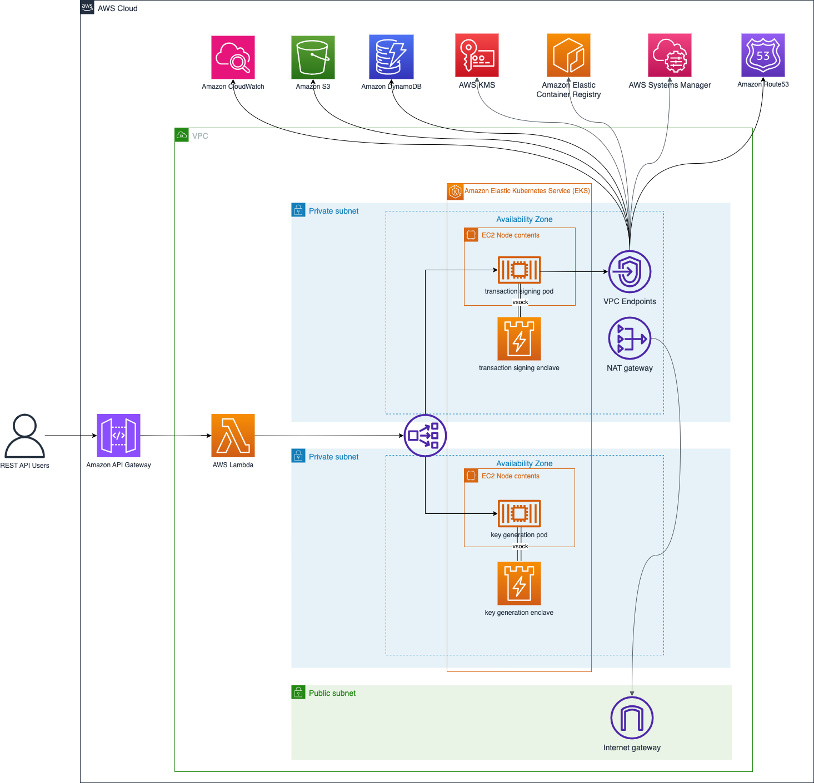

# AWS EKS Nitro Wallet Walk Through

## Solution overview

### Deployment overview



### Application overview


## Prerequisites

For this walk through, you must have the following prerequisites:

* An [AWS account](https://signin.aws.amazon.com/signin?redirect_uri=https%3A%2F%2Fportal.aws.amazon.com%2Fbilling%2Fsignup%2Fresume&client_id=signup)
* An [AWS Identity and Access Management](http://aws.amazon.com/iam) (IAM) user with administrator access
* [Configured AWS credentials](https://docs.aws.amazon.com/cdk/latest/guide/getting_started.html#getting_started_prerequisites)
* [Docker](https://docs.docker.com/get-docker/), [Node.js](https://nodejs.org/en/download/)
  , [Python 3](https://www.python.org/downloads/), [pip](https://pip.pypa.io/en/stable/installing/),
  and [jq](https://stedolan.github.io/jq/) installed on the workstation that you plan to deploy the solution from

## Clone Repository and provide Dependencies

* virtual environments ([venv](https://docs.python.org/3/library/venv.html#module-venv)) are recommended working with
  Python
* AWS CDK per default leverages virtual
  environments. [See how to activate virtualenv](https://cdkworkshop.com/30-python/20-create-project/200-virtualenv.html)

   ```shell
   npm install -g aws-cdk && cdk –version
   ```

To install the sample application, complete the following steps:

1. Install the AWS CDK and test the AWS CDK CLI:

   ```shell
   npm install -g aws-cdk && cdk –version
   ```

2. Download the code from the GitHub repo and change to the new directory:

   ```shell
   git clone https://gitlab.aws.dev/proserve-es/publicblockchain/eks_nitro_wallet.git
   ```

3. Change to the eks_nitro_wallet repository:

   ```shell
   cd eks_nitro_wallet
   ```

4. Install the dependencies using the Python package manager:

   ```shell
   pip install -r requirements.txt
   ```


5. Synth the solution.


## Deploy the EKS Cluster

1. Export environment variables.

[//]: # (todo add missing env)
```shell

```

2. Deploy the sample code with the AWS CDK CLI:

   ```shell
   cdk deploy cdk deploy devEksNitroWalletStack --verbose -O EksOutput.json
   ```

   AWS CDK asks for an additional confirmation to deploy the solution, as shown in the following screenshot.

  

3. Enter `y` to confirm.

   After the deployment is complete, the terminal shows us the additional parameters like the Auto Scaling group name.
   These values have also been written to `output.json` in JSON format.

   

   As you can see, the deployment took roughly 25 minutes to be finished.

4. Run script to configure local `kubectl` environment.

5. Run script to install Nitro Enclave plugin and label EKS nodes


## Deploy Ethereum Application Stack

1. Configure environment by running script:
   
2. Build enclaves by running the following scripts:

3. 

